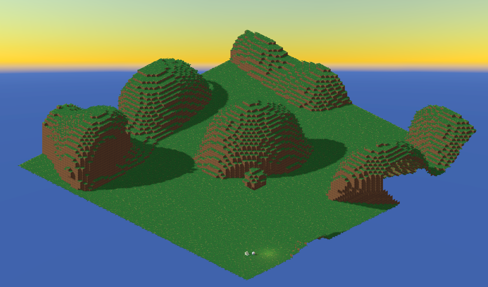

## About

This a voxel world prototype implemented in the Unity game engine. The world is rendered with an indirect draw call, meaning the voxel meshes are generated on the fly in a compute shader and then sent to the vertex shader in a structured buffer. This allows the entire world to be generated near instantly, which enables cool features like z scrolling through the world's layers. Voxels can be both cubes, or custom meshes specified by the user. Grass is also generated in a compute shader and placed on surface grass voxels.

## Controls

- WASD keys to move camera
- = and - keys to zoom camera
- IJKL keys to move point light

## Performance

On a RTX 3090 at a resolution of 3840 x 2160, this implementations runs at ~450 fps with grass enabled, and ~600 fps with grass disabled.

## Screenshots

Smaller world

Instant z scrolling through world layers

Grass shader and custom voxel type

Larger world sizes

